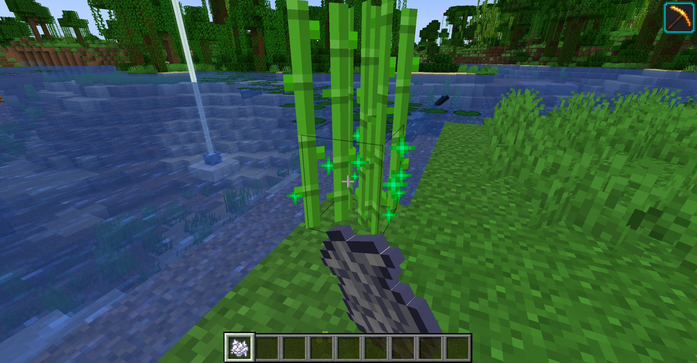
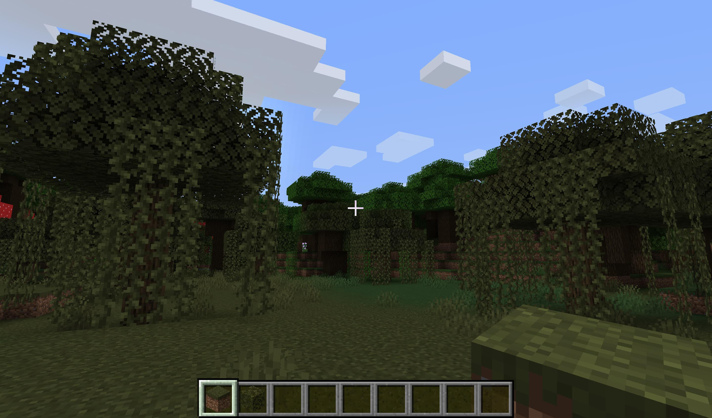
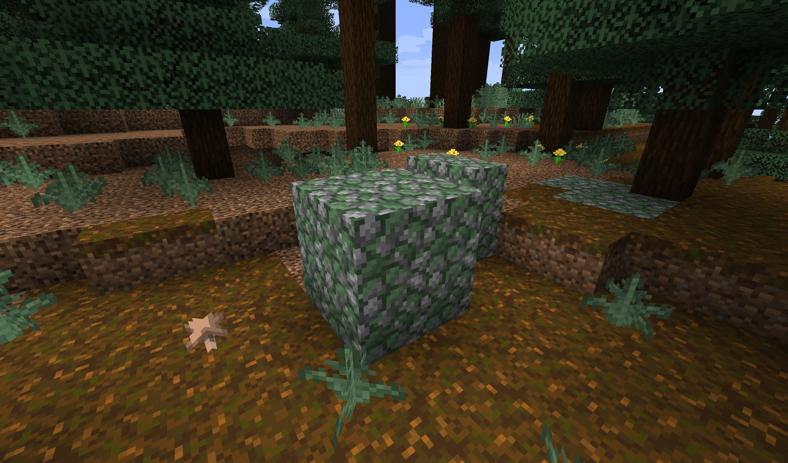
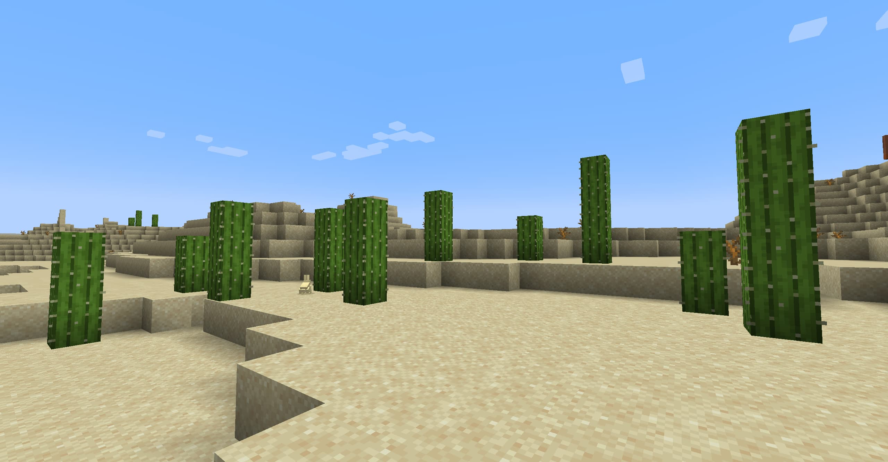
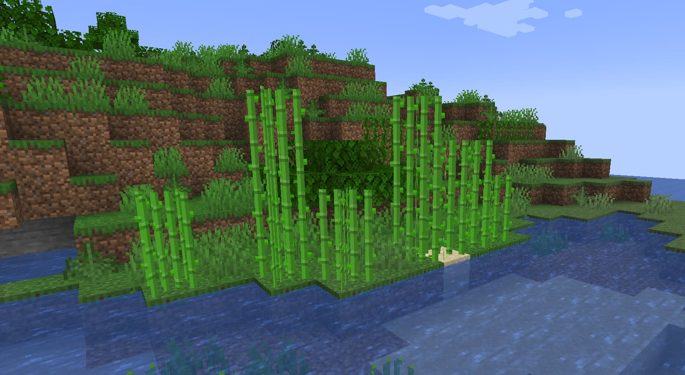
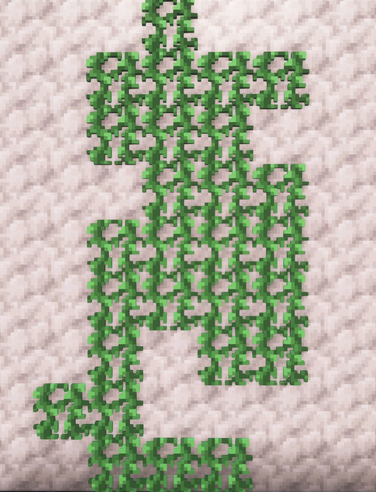
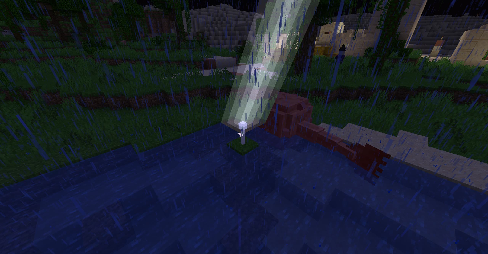
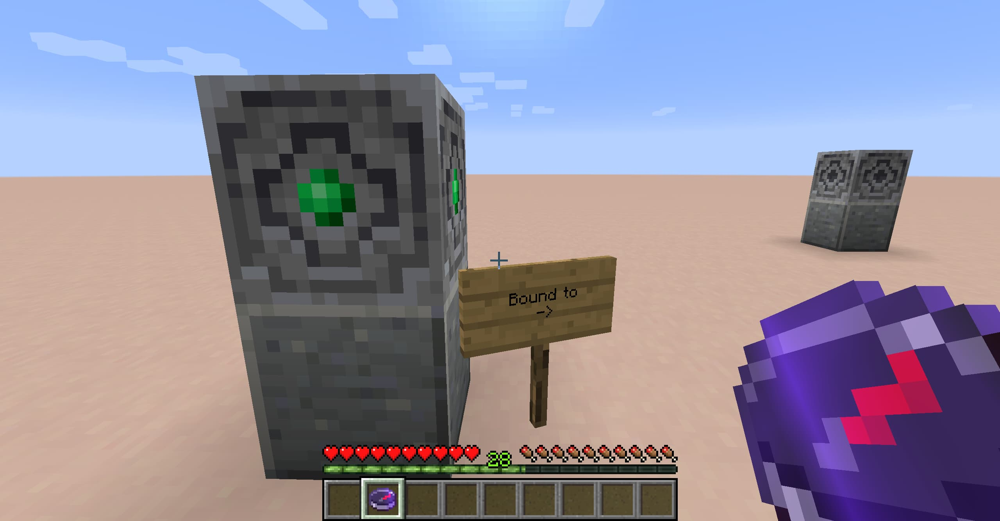

# Fundamental

## Features

Features can be turned off through the configuration file.

### Bonemeal Spreads Grass

Like with Nylium, you can use bonemeal on dirt that is neighboring grass to spread that grass quicker.

Built in support for Quark, Botania, Tinker's Construct, and Biomes You'll Go.  
Extra support can be added through the configuration file. PRs are also welcome.

### Bonemeal grows cactus, sugar cane & spreads lily pads

### Named Lodestone Compass

You can name your lodestones by placing a sign on them

Binding your compass to the lodestone will automatically name it 
using the text from the sign, instead of "Lodestone Compass".

*Bonus*: Right-clicking the sign instead of the Lodestone will also work.

### Crafting Tables

Enjoy our large selection of crafting tables, now available in all vanilla colors.

*Tip*: custom crafting tables can be crafted into regular crafting tables. Mainly as a workaround for recipes that demand a vanilla table.

### Slime on piston

You can place slime on a piston by right-clicking slime on a piston face.

You can also use an axe to scrape that slime off. (You don't get the slimeball back).

### Grass Item respects biome color

### Mossy stones follow biome colors

[View gallery](docs/screenshots/mossy_cobblestone)

This behavior is also available for Mossy stone bricks.

If you make a ressource pack that improves the moss overlay, send it our way!

### Randomized plant height

No more plant uniformity after staying in an area for too long. Cacti, sugar canes, and vine will stop growing at different
heights to give them a more natural feeling.

Very noticeable on vines. Unlike in vanilla, they will not grow forever.

Unlike newer vanilla plants, growth height is based on the plant's coordinates. This means the same coordinates will always result
in the same plant height, but it removes the need for an extra block state for these blocks.

### Lightning Strikes turn Guardians into Elder Guardians

### Bound Lodestone

The Bound Lodestone acts like a Lodestone, but is attuned to another lodestone in the world.

Use a Lodestone Compass on an unbound Lodestone to attune it to the same coordinates.

Once a Bound Lodestone has been attuned,
use a regular Compass on the Bound Lodestone to attune it to Lodestone that the Bound Lodestone is attuned to.

*TL;DR* it's a lodestone proxy

You can get it from your local Cartographer

