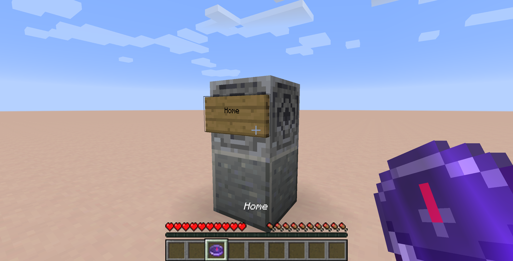
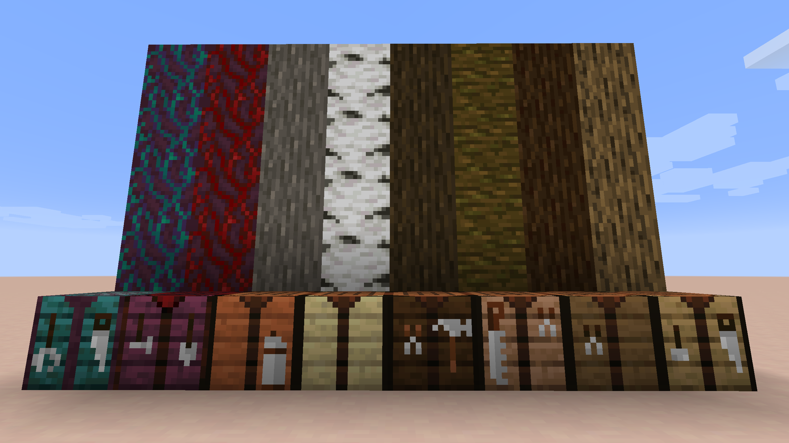
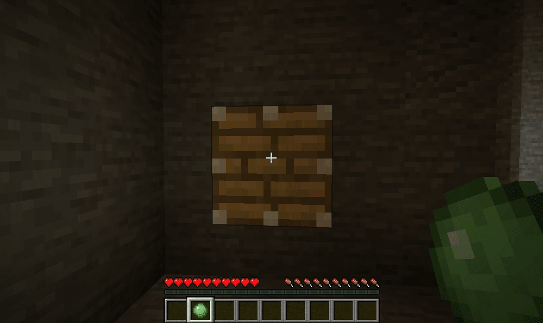
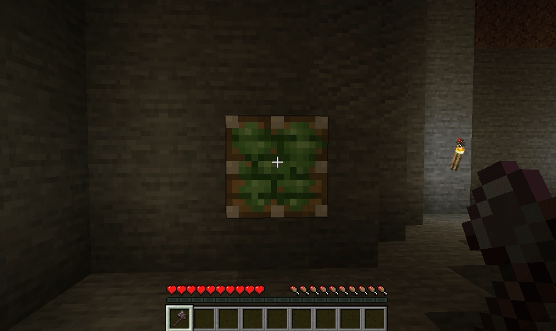
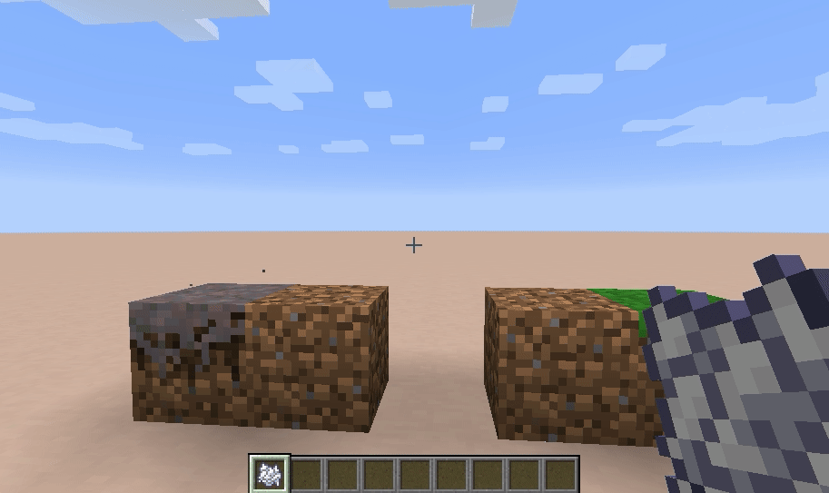
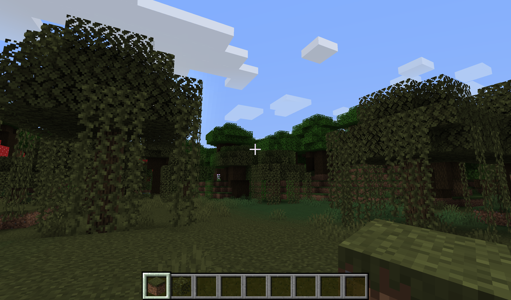
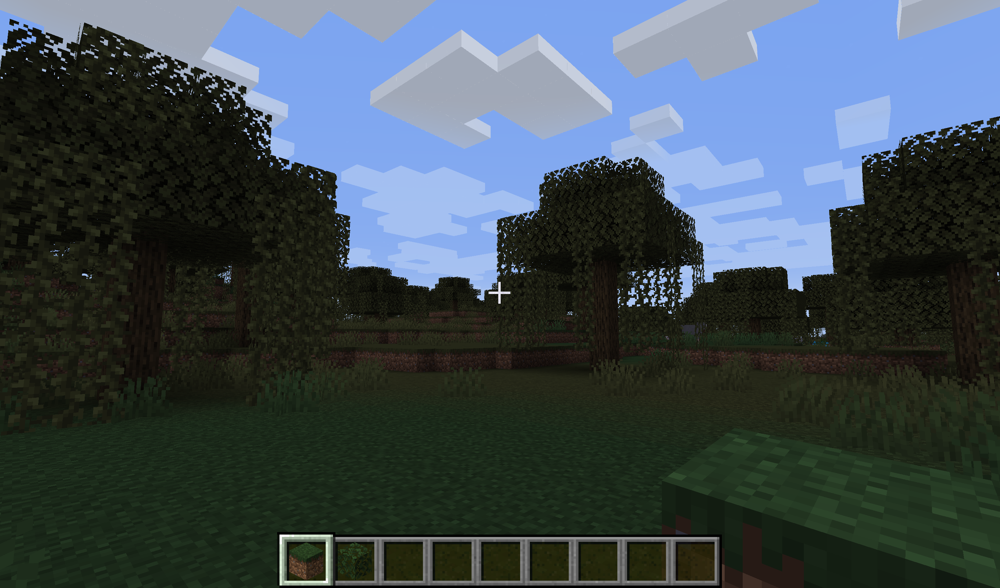
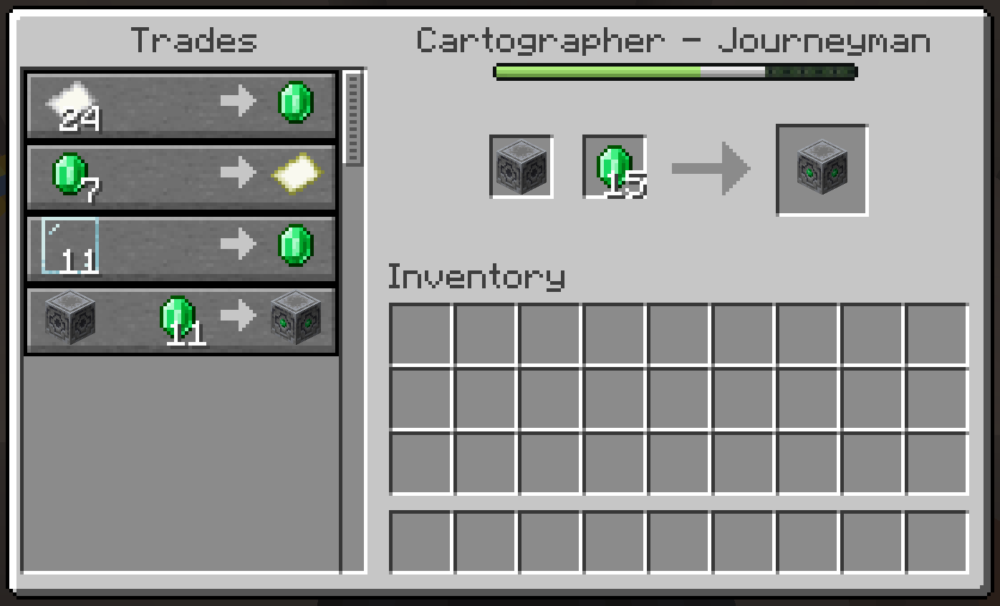

# Fundamental

## Features

**Named Lodestone Compass**

You can name your lodestones by placing a sign on them

Binding your compass to the lodestone will automatically name it 
using the text from the sign, instead of "Lodestone Compass".

*Bonus*: Right clicking the sign instead of the Lodestone will also work.

**Crafting Tables**

Enjoy our large selection of crafting tables, now available in all vanilla colors.

*Tip*: custom crafting tables can be crafting into regular crafting tables. Mainly as a workaround for recipes that demand a vanilla table.

**Slime on piston**

You can place slime on a piston by right-clicking slime on a piston face.

You can also use an axe to scrape that slime off. (You don't get the slimeball back).

**Bonemeal Spreads Grass**

Like with Nylium, you can use bonemeal on dirt that is neighboring grass to spread that grass quicker.

Built in support for Quark, Botania, Tinker's Construct, and Biomes You'll Go.  
Extra support can be added through the configuration file. PRs are also welcome.

**Grass Item respects biome color**

**Bound Lodestone**

The Bound Lodestone acts like a Lodestone, but is attuned to another lodestone in the world.

Use a Lodestone Compass on an unbound Lodestone to attune it to the same coordinates.

Once a Bound Lodestone has been attuned,
use a regular Compass on the Bound Lodestone to attune it to Lodestone that the Bound Lodestone is attuned to.

*tl;dr* it's a lodestone proxy

You can get it from your local Cartographer

